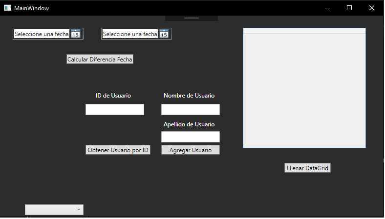

# C# - WPF - SQLSERVER 

_Este es un proyecto para ser usado como ejemplo, donde se implementa WPF con una conexion a SQL SERVER_
## Atencion! ⚠️
Recuerda ejecutar el archivo _SQLQueryDEY.sql_ en tu base de datos para tener la tabla que se usa en el ejemplo

## Preview 🛠️
_Project Preview_
_/Previsualizacion del Proyecto_



###  Implementacion de Conexion y sentencias SQL 📋
_EjecutarQuery.cs_

_selectSQL()_
```csharp
//obtener un registro mediante el id
public static List<usuario> selectSQL(int id)
{
    using (SqlConnection connection = new SqlConnection(connectionString))
    {
        SqlCommand command = new SqlCommand(null, connection);
        DataTable dt = new DataTable();
        // Create and prepare an SQL statement.
        command.CommandText = $"select * from usuario where id_usuario = {id}";

        try
        {
            connection.Open();
            var DataAdapter = new SqlDataAdapter(command);
            DataAdapter.Fill(dt);
            usuario _usuario = new usuario();
            listaUsuarios = new List<usuario>();
            _usuario.id_usuario = int.Parse((dt.Rows[0]["id_usuario"].ToString()));
            _usuario.nombre = dt.Rows[0]["nombre"].ToString();
            _usuario.apellido = dt.Rows[0]["apellido"].ToString();
            listaUsuarios.Add(_usuario);
        }
        catch (Exception ex)
        {
            Console.WriteLine(ex.Message);
        }

        connection.Close();
    }
    return listaUsuarios;
}
```
_selectAllUsuariosSQL()_
```csharp
//se obtienen todos los usuarios en la BD
public static List<usuario> selectAllUsuariosSQL()
{
    var dt = new DataTable();

    using (SqlConnection connection = new SqlConnection(connectionString))
    {
        //command nos prepara la query a ejecutar
        SqlCommand command = new SqlCommand(null, connection);
        command.CommandText = "select * from usuario ";

        connection.Open();
        var DataAdapter = new SqlDataAdapter(command);
        DataAdapter.Fill(dt);
        listaUsuarios = new List<usuario>();

        foreach (DataRow row in dt.Rows)
        {
            usuario usuarioTemp = new usuario();
            usuarioTemp.id_usuario = int.Parse(row["id_usuario"].ToString());
            usuarioTemp.nombre = row["nombre"].ToString();
            usuarioTemp.apellido = row["apellido"].ToString();
            listaUsuarios.Add(usuarioTemp);
        }
    }
    return listaUsuarios;
}
```

_insertSQL()_
```csharp
public static void insertSQL( string nombre,string apellido)
{
    using (SqlConnection connection = new SqlConnection(connectionString))
    {
        SqlCommand command = new SqlCommand(null, connection);

        // Create and prepare an SQL statement.
        command.CommandText = "INSERT INTO usuario (nombre, apellido) " + "VALUES (@nombre, @apellido)";             
        command.Parameters.AddWithValue("@nombre", nombre);
        command.Parameters.AddWithValue("@apellido", apellido);

        try
        {
            connection.Open();
            Int32 rowsAffected = command.ExecuteNonQuery();
            Console.WriteLine("RowsAffected: {0}", rowsAffected);
        }
        catch (Exception ex)
        {
            Console.WriteLine(ex.Message);
        }

        connection.Close();
    }
}
```


## Expresiones de Gratitud 🎁

* Comenta a otros sobre este proyecto 📢
* Da las gracias públicamente 🤓.

